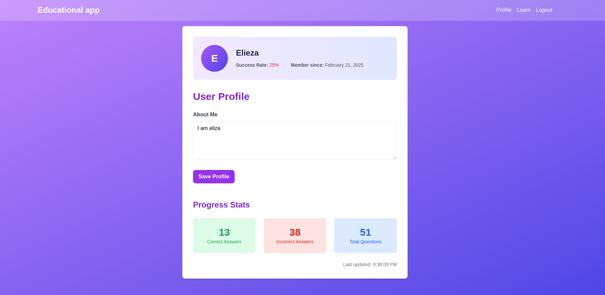

# MathWhiz: AI-Powered Math Learning App

MathWhiz is an innovative, AI-powered math learning application designed to help students of all levels between age of (13 -17)improve their mathematical skills through adaptive practice and personalized learning. By leveraging cutting-edge AI technology, MathWhiz creates a dynamic learning environment that adjusts to each student's needs, making math practice both engaging and effective. When a student gets a question wrong a new question is generated to with proper guide to help student solve the question. The new generated question is then saved to the database.

## Features

- **User Authentication**: Secure login and registration system for personalized experiences.
- **Adaptive Difficulty Levels**: Questions tailored to beginner, intermediate, and advanced skill levels.
- **AI-Generated Questions**: Utilizes Google's Generative AI to create unique, similar questions when students answer incorrectly.
- **Real-time Feedback**: Instant evaluation of answers with explanations for incorrect responses.
- **Progress Tracking**: Comprehensive statistics on correct answers, mistakes, and overall performance.
- **Interactive Learning Interface**: User-friendly design with animations and visual feedback.
- **Profile Management**: Personalized user profiles with progress summaries and learning goals.
- **Streak Tracking**: Motivational feature to encourage consistent practice and improvement.


## Screenshots





## Technology Stack

- **Frontend**: Vue.js 3 with Composition API
- **Backend**: Node.js with Express.js
- **Database**: MongoDB
- **AI Model**: Google's Generative AI (Gemini 1.5 Pro)
- **Authentication**: JWT (JSON Web Tokens)
- **Styling**: Tailwind CSS
- **API Integration**: RESTful API


## Database

We use MongoDB as our database to store math questions. The questions are stored with the following structure:

```json
{
  "difficulty": "entry" | "mid" | "advanced",
  "question": "What is 5 + 3?",
  "answer": "8",
  "explanation": "To add 5 and 3, you can count up 3 more from 5: 6, 7, 8.",
  "generatedFrom": "What is 2 + 4?",
  "steps": ["Step 1: ...", "Step 2: ..."],
  "concepts": ["Addition", "Counting"],
  "mistakes": ["Forgetting to carry over", "Mixing up addition and subtraction"]
} 
```


# Getting started
## Prerequistes
Ensure you have the following installed:

* Node.js (v18+ recommended)

* MongoDB

* Git


## Project Setup
```bash
git clone git@github.com:mwihoti/educationapp.git
cd educationapp
```
## Install dependencies

```sh
npm install
```
## Runing application locally
### Start the backend server
Navigate to the server directory:
```
cd server
```
Create a .env file and add the following environment variables:
```
PORT=5000
MONGO_URI=mongodb://localhost:27017/mathwhiz
JWT_SECRET=your_jwt_secret
GEMINI_API_KEY=your_gemini_api_key
```
Start the backend server:
```
npm run dev
```
The backend will run on http://localhost:5000


## Start the Frontend

Navigate to the frontend directory:
```
cd src
```
Start the development server:
```
npm run dev
```

API Endpoints

Authentication
```
POST /api/auth/register - Register a new user

POST /api/auth/login - Log in to the application
```
Questions
```
GET /api/questions?difficulty=entry - Fetch questions based on difficulty level

POST /api/questions/generate-similar - Generate a similar question using AI
```
User Progress
```
GET /api/user/progress - Retrieve user's progress

PATCH /api/user/update-score - Update user score based on correct/incorrect answers
```
The frontend will be accessible at http://localhost:5173.


### Run Unit Tests with [Vitest](https://vitest.dev/)

```sh
npm run test:unit
```

### Run End-to-End Tests with [Cypress](https://www.cypress.io/)

```sh
npm run test:e2e:dev
```

This runs the end-to-end tests against the Vite development server.
It is much faster than the production build.

But it's still recommended to test the production build with `test:e2e` before deploying (e.g. in CI environments):

```sh
npm run build
npm run test:e2e
```

### Lint with [ESLint](https://eslint.org/)

```sh
npm run lint
```

